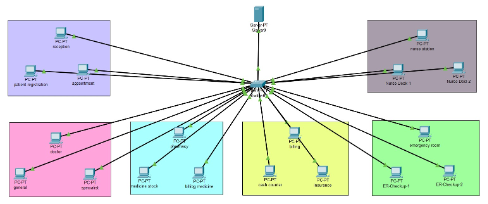
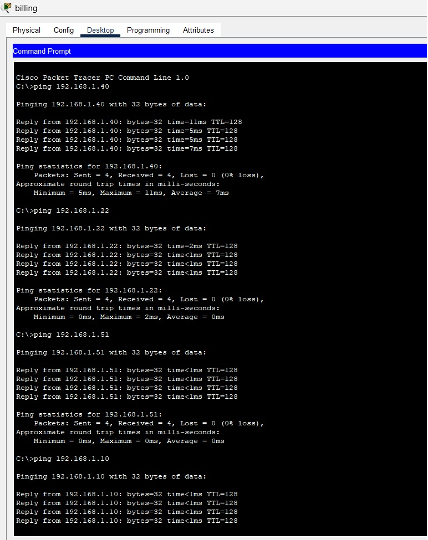

# -hospital-management-network

# Hospital Management Network Design (Cisco Packet Tracer)

## 📌 Project Overview
This project represents a **Hospital Management Network** designed and simulated using Cisco Packet Tracer.  
The network connects multiple hospital departments through a central switch and server, enabling efficient communication and data sharing.

---

## 🏥 Departments Included
The hospital network consists of the following departments:

- Reception  
  - Reception System  
  - Patient Registration  
  - Appointment  

- Doctor  
  - Doctor  
  - General  
  - Specialist  

- Pharmacy  
  - Pharmacy  
  - Medicine Stock  
  - Billing Medicine  

- Billing  
  - Billing  
  - Cash Counter  
  - Insurance  

- Emergency Room  
  - Emergency Room  
  - ER-Checkup-1  
  - ER-Checkup-2  

- Nurse Station  
  - Nurse Station  
  - Nurse Desk-1  
  - Nurse Desk-2  

---

## 🖥️ Network Design

- **Topology Used:** Star Topology  
- **Central Device:** Cisco 2960 Switch  
- **Server:** Centralized hospital server  
- **End Devices:** Multiple PCs (for each department)  
- **Connections:** Copper Straight-Through cables  

All departments are connected to a **central switch**, which allows communication between systems.

---

## 🌐 IP Addressing Scheme

| Department      | Network Address | Example IP        |
|----------------|----------------|------------------|
| Reception       | 192.168.10.0/24 | 192.168.10.40   |
| Doctor          | 192.168.20.0/24 | 192.168.20.22   |
| Pharmacy        | 192.168.30.0/24 | 192.168.30.30   |
| Billing         | 192.168.40.0/24 | 192.168.40.40   |
| Emergency Room  | 192.168.50.0/24 | 192.168.50.51   |
| Nurse Station   | 192.168.60.0/24 | 192.168.60.60   |
| Server          | Static          | 192.168.10.10   |

---

## ⚙️ Technologies Used

- Cisco Packet Tracer  
- Static IP Addressing  
- Switch-based Communication  
- Network Simulation  

---

## 🔄 Working of the System

1. Each department is connected to a central switch.
2. Data is sent from one department to another through the switch.
3. The server stores hospital data such as:
   - Patient records  
   - Billing information  
   - Medicine details  
4. Departments communicate using IP addresses.
5. Connectivity is verified using the **ping command**.

---

## 📊 Output / Results

Communication between departments is tested using ping:

| Source | Destination | Result |
|--------|------------|--------|
| Billing PC | Reception PC | Success |
| Billing PC | Doctor PC | Success |
| Billing PC | Emergency Room PC | Success |
| Billing PC | Server | Success |

-  0% Packet Loss  
-  Stable communication  

---

## 📸 Screenshots

### Hospital Network Topology

### Ping Output

---

## ✅ Advantages

- Simple and easy to implement  
- Low cost (minimal devices used)  
- Centralized data management using server  
- Easy communication between departments  
- Scalable for future expansion  

---

## 🚀 Future Improvements

- Add routers for advanced routing  
- Implement VLAN for better segmentation  
- Add wireless devices (Wi-Fi)  
- Implement security (ACL, firewall)  
- Integrate IP phones and CCTV  

---

## 👩‍💻 Project By-

Samprati Tikone, 
Saukhya Gaikwad, 
Jiya Kanojiya 

---

